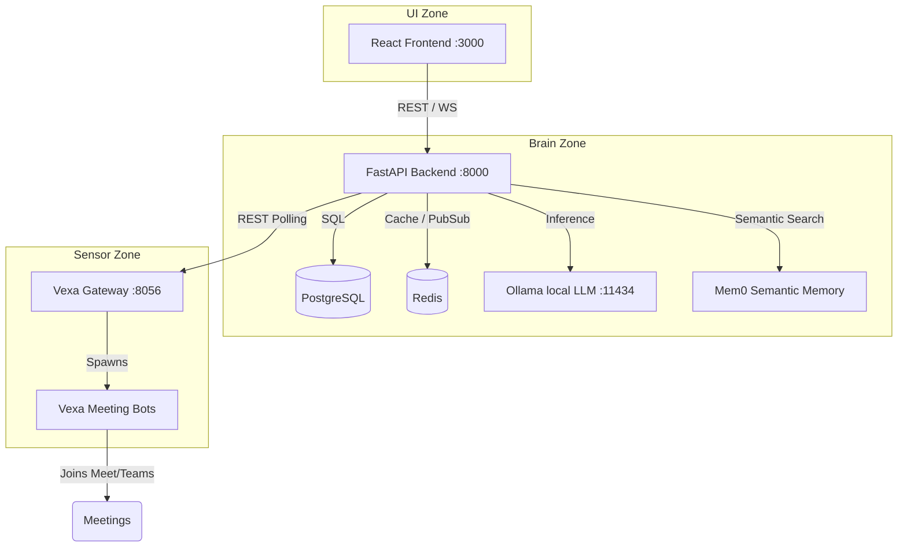

<div align="center">

# MeetingMind AI

**Self-hosted, offline-first multi-agent meeting assistant for Agile operations.**

[](LICENSE)
[](#-quickstart--deployment)
[](#)

</div>

---

MeetingMind AI is an advanced, fully self-hosted system that brings an AI bot into your meetings (Google Meet, Microsoft Teams) to transcribe, summarize, and generate structured Agile reports—all while keeping your data offline and secure.

## Key Feature Highlights

- **Agile Meeting Modes (Sprint Planning vs General)**: Tailored extraction pipelines and agendas customized for **Sprint Planning**, **Daily Standup**, and **General Syncs**, tuning persona extraction prompts to your meeting type.
- **Live Thinking Stream**: Real-time visibility into the multi-agent cognitive process as the Tech Lead, Product Manager, and Scrum Master deliberate, challenge trade-offs, and synthesize reports.
- **Document Picture-in-Picture (PiP)**: Native Chrome floating mini-window overlaying your call with live transcript streaming, Instant Clarity Q&A, and one-click action item triage.
- **Transcript Auditing & Rollback**: Review and edit speech-to-text utterances, manually insert missed points, and perform one-click rollbacks via full audit history (`original_text`, `original_speaker`, `edited_at`) before re-summarizing.
- **HTML Email Reports via Resend HTTP API**: Instant delivery of formatted meeting digests and action items directly via HTTPS, avoiding cloud provider SMTP port blocking.
- **Real-Time System Diagnostics**: Interactive diagnostic probe (`GET /api/system/status`) inspecting Ollama hardware acceleration, active VRAM/RAM model footprint, latency, PostgreSQL, Redis, Qdrant, and Whisper services.

## Default Local AI Models

| Task | Default Model | Runtime / Engine | Notes |
|---|---|---|---|
| **LLM Inference (Extraction, Debate, Synthesis)** | `hermes3:8b` | Ollama (Local) | Fast multi-persona reasoning, instruction following, and structured JSON output |
| **Vector Embeddings** | `nomic-embed-text` | Ollama (Local) | 768-dim embeddings powering Mem0 long-term memory in Qdrant |
| **Speech-to-Text (STT)** | `small.en` | Local Whisper | CPU-optimized (~18x real-time, drift-free); GPU setups can select `large-v3-turbo` |

Alternative models (such as `qwen2.5:14b` for high-VRAM GPU setups) can be configured dynamically at any time using `./change_models.sh`.

## Documentation

For a deep dive into the architecture, APIs, and features, see the **[Documentation Hub](docs/README.md)**.


## Repository Structure

This repository is a monorepo that orchestrates the following submodules/zones:

| Component | Description |
|-----------|-------------|
| **[`backend/`](backend/README.md)** | **Brain Zone:** FastAPI orchestration, transcription ingestion (PostgreSQL + Redis), and Ollama AI summarization. |
| **[`frontend/`](frontend/README.md)** | **UI Zone:** React + Vite interface. A dashboard for managing meetings, kanban boards, and AI reports. |
| **[`vexa/`](vexa/README.md)** | **Sensor Zone:** Open-source Vexa meeting bot stack that joins calls and streams speaker-attributed transcripts. |
| **[`docs/`](docs/README.md)** | Central documentation hub containing detailed architecture and API references. |

## Architecture



- **Sensor Zone (`vexa/`)**
  - Runs the Vexa bot stack locally (Supports both CPU and GPU setups).
  - Exposes:
    - API Gateway: `http://localhost:8056`
    - Admin API: `http://localhost:8057`
    - Dashboard: `http://localhost:3001`
- **Brain Zone (`backend/`)**
  - FastAPI service on `http://localhost:8000`
  - PostgreSQL + Redis
  - Ollama container on `http://ollama:11434` (accessible within the Docker network)
  - Mem0 semantic memory layer (mem0ai) for cross-meeting context
  - Uses fully merged, clean transcripts via Vexa REST API polling (WebSocket ingestion removed)
- **UI Zone (`frontend/`)**
  - Vite React App on `http://localhost:3000` or `https://<server-ip>`

## Prerequisites & System Requirements

### Minimum Hardware Specs
- **RAM:** Minimum 10GB of RAM allocated to Docker.
- **CPU:** 4+ Cores recommended.
- **Storage:** 20GB+ free space for Docker images, LLM weights, and Whisper models.

### OS-Specific Setup

#### macOS (Apple Silicon / Intel)
- Install **Docker Desktop for Mac**.
- Open Docker Desktop Settings -> Resources -> **Allocate at least 12GB of RAM**.
- The `setup.sh` script automatically applies memory optimizations (e.g., disabling unused Vexa services) to keep the stack lightweight on Macs.

#### Windows
- Install **WSL2** (Windows Subsystem for Linux) and a Linux distribution like Ubuntu.
- Install **Docker Desktop for Windows** and enable **WSL Integration** in Settings -> Resources -> WSL Integration.
- Ensure Docker Desktop is allocated enough memory (via `.wslconfig` if necessary, setting `memory=12GB`).
- Run the `setup.sh` script **inside your WSL terminal** (do not use PowerShell or Command Prompt).

#### Linux
- Docker + Docker Compose plugin installed.
- NVIDIA Container Toolkit (for GPU hosts).
- Enable NVIDIA Persistence Mode on the host to prevent GPU power-down latency spikes:
  ```bash
  sudo nvidia-smi -pm 1
  ```

## Quickstart & Deployment

We provide an automated setup script that handles dependencies, the Vexa bot, database migrations, and LLM pulls.

### 1. Run the Setup (Cold Start)

To perform a complete setup interactively from a cold start, run:
```bash
make setup
```

**Non-Interactive Mode:** 
If you want to skip optional configuration prompts (like email alerts or Nvidia persistence mode), you can still call the script directly:
```bash
./setup.sh --non-interactive
```

This setup process will:
1. Generate the necessary `.env` files.
2. Start the core database, Redis, and Qdrant containers.
3. Start the Vexa transcription services.
4. Mint a Vexa API key and link it to your backend.
5. Boot the MeetingMind backend and frontend.
6. Run PostgreSQL database migrations.
7. Pull the required Ollama models.

### 2. Standard Start / Stop

If you have already run the setup and just want to bring the existing stack up or down without rebuilding:
```bash
make up
make down
```

### 3. Rebuilding the Stack

If you pull new code or make changes to the backend/frontend and want to apply them, you can rebuild the core stack quickly by running:
```bash
make rebuild
```
This performs a safe `docker compose up -d --build` for the main stack and also restarts/rebuilds the Vexa stack to pick up any changes, without destroying your data or requiring a full cold start.

### 4. Access the Web UI

Once the setup completes and all containers are running, open the app in your browser:

| Scenario | URL |
|---|---|
| Running on your local machine | `http://localhost:3000` |
| Accessing a remote server / VM | `https://<server-ip>` |

> **Why does the browser show "Not Secure"?**
>
> The frontend container generates a **self-signed SSL certificate** at build time. Because it is not signed by a trusted Certificate Authority, browsers flag it as untrusted. This is expected behaviour for a self-hosted POC — the connection is still encrypted.
>
> **To accept the certificate and proceed (one-time per browser):**
> - **Chrome / Edge**: Click **Advanced** → **Proceed to \<address\> (unsafe)**
> - **Firefox**: Click **Advanced…** → **Accept the Risk and Continue**
> - **Safari**: Click **Show Details** → **visit this website**
>
> **Tip:** If you are accessing from your local machine, `http://localhost:3000` works without any certificate warning because browsers treat `localhost` as a secure context.

## Changing AI Models
 
By default, MeetingMind runs `hermes3:8b` for summarization, debate, and final synthesis, `nomic-embed-text` for vector embeddings, and `small.en` for Whisper transcription (optimized for English on CPU with ~18x real-time performance and zero language-detection drift; GPU setups can select `large-v3-turbo`). You can easily switch models using the included interactive configuration script:
 
```bash
./change_models.sh
```
 
This script prompts for new LLM and Whisper model names, updates the appropriate `.env` files, and safely restarts the affected Docker containers to apply changes immediately.

## Updating Vexa

The Vexa core logic and bot are frequently updated. To grab the latest changes without fully reinstalling:

```bash
./update_vexa.sh
```

This script will pull the latest Vexa submodule updates, fetch the latest docker images, and restart the Vexa services smoothly.
