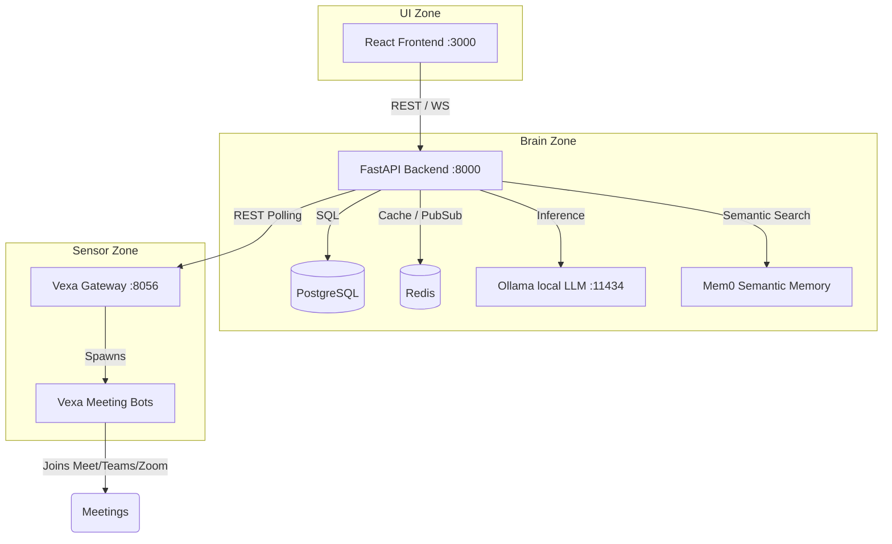

<div align="center">

# MeetingMind AI

**Self-hosted, offline-first multi-agent meeting assistant for Agile operations.**

[](LICENSE)
[](#-quickstart--deployment)
[](#)

</div>

---

MeetingMind AI is an advanced, fully self-hosted system that brings an AI bot into your meetings (Google Meet, Teams, Zoom, Jitsi) to transcribe, summarize, and generate structured Agile reports—all while keeping your data offline and secure.

## 📚 Documentation

For a deep dive into the architecture, APIs, and features, see the **[Documentation Hub](docs/README.md)**.

## ✨ Recent Updates (July 2026)
- **Kanban Task Deletion**: Added a dedicated `DELETE` endpoint and UI trash bin button for permanently removing action items from the Global Kanban board.
- **Proposal Category Display**: Fixed an issue where all live proposals were categorized as "PARKING LOT" by normalizing the frontend's mapping of backend `action_type` strings to local component types.
- **Empty Transcript Handling**: Resolved an issue where meetings without transcript content would cause an infinite loading spinner on the Review page. The backend now persists a fallback summary to properly unblock the UI.
- **Loading Overlay Stability**: Prevented accidental deletion of completed meetings by dismissing the loading overlay (and its "Cancel" button) immediately upon bot `completed` or `failed` states.

## 🏗 Repository Structure

This repository is a monorepo that orchestrates the following submodules/zones:

| Component | Description |
|-----------|-------------|
| **[`backend/`](backend/README.md)** | **Brain Zone:** FastAPI orchestration, transcription ingestion (PostgreSQL + Redis), and Ollama AI summarization. |
| **[`frontend/`](frontend/README.md)** | **UI Zone:** React + Vite interface. A dashboard for managing meetings, kanban boards, and AI reports. |
| **[`vexa/`](vexa/README.md)** | **Sensor Zone:** Open-source Vexa meeting bot stack that joins calls and streams speaker-attributed transcripts. |
| **[`docs/`](docs/README.md)** | Central documentation hub containing detailed architecture and API references. |

## 📐 Architecture



- **Sensor Zone (`vexa/`)**
  - Runs the Vexa bot stack locally (Supports both CPU and GPU setups).
  - Exposes:
    - API Gateway: `http://localhost:8056`
    - Admin API: `http://localhost:8057`
    - Dashboard: `http://localhost:3001`
- **Brain Zone (`backend/`)**
  - FastAPI service on `http://localhost:8000`
  - PostgreSQL + Redis
  - Ollama container on `http://ollama:11434` (accessible within the Docker network)
  - Mem0 semantic memory layer (mem0ai) for cross-meeting context
  - Uses fully merged, clean transcripts via Vexa REST API polling (WebSocket ingestion removed)
- **UI Zone (`frontend/`)**
  - Vite React App on `http://localhost:3000` or `https://<server-ip>`

## ⚙️ Prerequisites

- Docker + Docker Compose
- NVIDIA Container Toolkit (Linux GPU hosts)
- Python 3.11+ (if running services outside Docker)
- Mem0 configuration (defaults to Ollama)
- Ollama model pulled inside the Docker container (see Step 6)
- Enable NVIDIA Persistence Mode on the host to prevent GPU power-down latency spikes:
  ```bash
  sudo nvidia-smi -pm 1
  ```
  This keeps the driver and GPU awake between transcript chunks, avoiding cold-start delays.

## 🚀 Quickstart & Deployment

We provide an automated setup script that handles dependencies, the Vexa bot, database migrations, and LLM pulls.

### 1. Run the Setup Script

To perform a complete setup interactively:
```bash
./setup.sh
```

**Non-Interactive Mode:** 
If you want to skip optional configuration prompts (like email alerts or Nvidia persistence mode), run:
```bash
./setup.sh --non-interactive
```

This script will:
1. Generate the necessary `.env` files.
2. Start the core database, Redis, and Qdrant containers.
3. Start the Vexa transcription services.
4. Mint a Vexa API key and link it to your backend.
5. Boot the MeetingMind backend and frontend.
6. Run PostgreSQL database migrations.
7. Pull the required Ollama models (`llama3`).

### 2. Access the Web UI

Once the setup completes and all containers are running, open the app in your browser:

| Scenario | URL |
|---|---|
| Running on your local machine | `http://localhost:3000` |
| Accessing a remote server / VM | `https://<server-ip>` |

> **Why does the browser show "Not Secure"?**
>
> The frontend container generates a **self-signed SSL certificate** at build time. Because it is not signed by a trusted Certificate Authority, browsers flag it as untrusted. This is expected behaviour for a self-hosted POC — the connection is still encrypted.
>
> **To accept the certificate and proceed (one-time per browser):**
> - **Chrome / Edge**: Click **Advanced** → **Proceed to \<address\> (unsafe)**
> - **Firefox**: Click **Advanced…** → **Accept the Risk and Continue**
> - **Safari**: Click **Show Details** → **visit this website**
>
> **Tip:** If you are accessing from your local machine, `http://localhost:3000` works without any certificate warning because browsers treat `localhost` as a secure context.

## 🔄 Updating Vexa

The Vexa core logic and bot are frequently updated. To grab the latest changes without fully reinstalling:

```bash
./update_vexa.sh
```

This script will pull the latest Vexa submodule updates, fetch the latest docker images, and restart the Vexa services smoothly.
