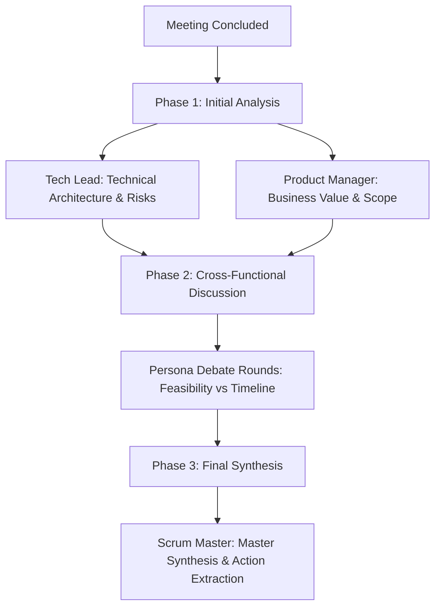

# MeetingMind AI Frontend Architecture

React + Vite frontend for MeetingMind AI. Served in production by Nginx inside Docker, with all `/api/*` requests proxied to the FastAPI backend.

---

## What it does

MeetingMind dispatches an AI bot into Google Meet or Microsoft Teams sessions. The bot captures and transcribes meeting audio in real time, while an Ollama-powered multi-agent pipeline generates structured summaries, action items, parking lot topics, and scheduling follow-ups. Everything is reviewable, editable, and trackable across team Kanban boards after the meeting ends.

---

## Pages & Routes

| Route | Page Component | Access | Description |
|---|---|---|---|
| `/login` | `Login.jsx` | Public | Login & sign-up with avatar image upload. |
| `/teams` | `Teams.jsx` | Protected | Team picker — list teams, switch context, or create a new team workspace. |
| `/join/:inviteToken` | `JoinTeam.jsx` | Protected | Team invitation link acceptance. |
| `/teams/:teamId` | `Dashboard.jsx` | Protected | Dashboard — meeting statistics, search, bot dispatch, meeting cards with topic tags. |
| `/teams/:teamId/kanban` | `GlobalKanban.jsx` | Protected | Agile Kanban board aggregating accepted action items across all team meetings into `To Do`, `In Progress`, and `Done` columns. |
| `/teams/:teamId/parking-lot` | `GlobalParkingLot.jsx` | Protected | Cross-meeting parking lot for deferred discussion topics with one-click "Promote to Task" migration. |
| `/teams/:teamId/schedule` | `GlobalSchedule.jsx` | Protected | Follow-up tracking view for deferred items pending a calendar date, equipped with inline date pickers. |
| `/teams/:teamId/archive` | `GlobalArchive.jsx` | Protected | Global archive for completed, rejected, or soft-deleted action items with topic filtering and restoration. |
| `/teams/:teamId/settings` | `Settings.jsx` | Protected | Team settings: General (rename), Members (roles, notification preferences, transfer ownership), Topics (custom taxonomy), AI Prompts (system prompt overrides), Invite Link, Danger Zone (transfer ownership, delete team, leave team). |
| `/teams/:teamId/live/:meetingId` | `Live.jsx` | Protected | Live meeting companion — real-time Whisper transcript, multi-agent thought streams, interactive proposal alerts, Instant Clarity explainer modals, and Document Picture-in-Picture. |
| `/teams/:teamId/review/:meetingId?` | `Review.jsx` | Protected | Post-meeting review workspace — tabbed AI synthesis (General, Technical, Business), live thinking progress indicators, inline transcript editing with original text preservation and reversion, action item moderation, and sandboxed HTML email previews. |
| `/popup` | `MiniPopup.jsx` | Protected | Standalone browser popup fallback for the companion mini-window when Document PiP is unavailable. |

All routes except `/login` and `/join/:inviteToken` require authentication via session cookies. Unauthenticated users are redirected to `/login`.

---

## User-Facing Features

**Auth & Onboarding**
- Email/password sign-up and login; session via `mm_session` cookie.
- Interactive 4-step Quickstart Tutorial (`QuickstartModal.jsx`) introducing multi-agent BOLAA personas, bot dispatching, in-call PiP/Instant Clarity, and Kanban sync.
- Dedicated Profile Modal (`ProfileModal.jsx`) for updating display name and uploading avatar photos.
- Replay tutorial anytime via "Quickstart Guide" in sidebar navigation or `/teams` header.
- Unauthenticated users are redirected to `/login`.

**Teams**
- Create teams and invite members via a shareable join link (`/teams`).
- Join a team via invite link (`/join/:inviteToken`).

**Dashboard**
- Stat cards: total meetings, pending review, action items, parking lot count.
- Dispatch bot by pasting a Google Meet or Teams URL (Teams supports passcode).
- Filter meetings by All / Needs Review / Reviewed; full-text search by title.
- Rename meetings inline (hover card, click pencil) and delete with confirmation.
- Tag meetings with team topics using the `+ Tag` button; remove tags on hover.

**Live view**
- Real-time Whisper transcript feed via WebSocket.
- Multi-agent thought stream panel (Tech Lead, Product Manager, Scrum Master).
- Interactive proposal toast alerts with audible chime and one-click triage.
- Instant Clarity explainer modals for technical and business context.
- Document Picture-in-Picture (PiP) floating overlay for always-on-top assistance.

**Review page**
- Tabbed AI synthesis (General, Technical, Business) with live thinking progress indicators.
- Inline transcript editing with original text preservation and one-click reversion.
- Action item moderation: accept, reject, or edit AI-generated proposals.
- Sandboxed HTML email digest preview with recipient picker and batch dispatch.

**Settings** (`/teams/:teamId/settings`)
- General: rename the team.
- Members: agile role assignment (`scrum_master`, `product_manager`, `team_member`), per-role notification preferences, and 1-click **Make Owner** ownership transfer.
- Topics: create, rename, recolor, and delete team topic tags.
- AI Prompts: per-key system prompt overrides for the multi-agent pipeline.
- Invite Link: generate a shareable join link (owner only).
- Danger Zone: transfer team ownership to another active member, permanently delete the team with type-to-confirm safety verification (owners), or leave team (members).

**Kanban / Parking Lot / Schedule / Archive**
- Action items aggregated across all team meetings into Kanban columns (To Do, In Progress, Done).
- Manual additions via the `+ Add Task` / `+ Add Item` modal with assignee and meeting association.
- Parking Lot: one-click **Promote to Task** migrates deferred topics to the Kanban board.
- Schedule: inline date picker appends target milestone dates to action items.
- Archive: cross-type view of soft-deleted and completed items with topic filtering and one-click restore.

**Demo mode**
- Sidebar toggle loads sample data across all pages.
- State persists in `localStorage`; switching off clears mock data immediately.

---

## Architectural Systems

### 1. Document Picture-in-Picture (PiP) Integration

MeetingMind integrates the W3C **Document Picture-in-Picture API** (`documentPictureInPicture.requestWindow()`) to provide an always-on-top desktop overlay while users attend meetings in external tabs or apps.

```
┌────────────────────────────────────────────────────────┐
│ Main Window (Live.jsx)                                 │
│                                                        │
│  1. Check 'documentPictureInPicture' in window         │
│  2. Request PiP window (380x560)                       │
│  3. Clone styleSheets & insert PiP baseline styles     │
│  4. Mount React root (createRoot) -> <MiniPipContent>  │
│  5. Bind BroadcastChannel('meeting-${id}')             │
└───────────────┬────────────────────────▲───────────────┘
                │                        │
       BroadcastChannel (sync)   BroadcastChannel (actions)
                │                        │
┌───────────────▼────────────────────────┴───────────────┐
│ Always-on-Top PiP Window (MiniPipContent)              │
│                                                        │
│  - Live elapsed timer & meeting status                 │
│  - Actionable proposal approval cards                  │
│  - Instant Clarity (Explain Technical / Business)      │
│  - "Return to Meeting" button (closes PiP, focuses tab)│
└────────────────────────────────────────────────────────┘
```

- **Capability Detection & Fallback**: Checks `'documentPictureInPicture' in window`. If unsupported, falls back to `window.open('/popup?...')` using `localStorage` for initial state hydration.
- **Stylesheet Cloning**: PiP windows initialize with empty document heads. The application clones all stylesheets from `document.styleSheets` (extracting `cssRules` or falling back to `<link>` tags for cross-origin sheets) into `pipWindow.document.head`. This ensures full design fidelity (CSS variables, dark theme, typography).
- **React Subtree Mounting**: Mounts an isolated React root into the child document using `createRoot(container)`.
- **Two-Way Inter-Window Communication (`BroadcastChannel`)**:
  - Main -> PiP: broadcasts `sync_timer` (elapsed seconds) and `sync_proposals` (pending proposals).
  - PiP -> Main: broadcasts `action_proposal` (`accepted`, `park`, `rejected`), which invokes the main window's mutation handlers.
- **Window Blur Auto-Opening Heuristic**: A `window.addEventListener('blur')` listener triggers `openPip(true)` when the user navigates to their video conference window. If `requestWindow()` throws `NotAllowedError` (due to missing transient user gestures), the error is silently swallowed.
- **Lifecycle & Cleanup**: Listens for the child window's `pagehide` event to cleanly unmount the React root, avoiding memory leaks. When the user clicks "Return to Meeting", `pipWindow.close()` is called and `mainWindow.focus()` restores focus to the main application tab.

---

### 2. Real-Time WebSocket Streaming Pipeline

Real-time audio transcription and live AI reasoning are driven by a persistent WebSocket connection via `openInsightSocket(meetingId, callbacks)` to `/api/ws/ingest/:meetingId`.

#### Event Contracts

| Event Name | Direction | Payload Structure | Frontend Handling |
|---|---|---|---|
| `transcript_snapshot` | Server -> Client | `{"event": "transcript_snapshot", "data": {"chunks": [...]}}` | Hydrates historical speaker utterances upon initial socket connection or reconnection. |
| `transcript_chunk` | Server -> Client | `{"event": "transcript_chunk", "data": {"id", "speaker", "text", "timestamp"}}` | Appends or updates the transcript feed. Implements **interim speech expansion**: matches recent chunks by ID, speaker + timestamp, or text prefix to stitch live progressive speech without jitter (`is_final` is defaulted client-side). |
| `insight` | Server -> Client | `{"event": "insight", "data": {"role", "text"}}` | Displays live Scrum Master contextual observations. Filtered according to user notification preferences. |
| `proposal` | Server -> Client | `{"event": "proposal", "data": {"id", "type", "content", "status"}}` | Enqueues pending action proposals (`to_do`, `parking_lot`, `to_schedule`, `blocker`). Triggers interactive toast alerts and audible chimes. |
| `agent_thought` | Server -> Client | `{"event": "agent_thought", "data": {"agent", "title", "text", "speaker", ...}}` | Streams live multi-agent deliberation traces into `LiveThinkingPanel`. |
| `summary_thought` | Server -> Client | `{"type": "summary_thought", "thought": {"agent", "title", "text"}}` | Streams post-meeting synthesis steps into `ThinkingProcess`. |

#### Web Audio Synthesizer
Proposal alerts generate a gentle chime using the **Web Audio API** (`AudioContext`, `OscillatorNode`, `GainNode`):
- Pure sine wave at 660 Hz (A#5 / E5 harmonic).
- Instantaneous attack to 20% gain at `currentTime`.
- Exponential decay (`exponentialRampToValueAtTime(0.001, currentTime + 0.6)`) over 600ms.
- Self-contained, zero-asset, zero-network-latency audio chime.

---

### 3. Thinking Stream State & Multi-Agent Orchestration

MeetingMind employs a 3-agent deliberation pipeline (Tech Lead, Product Manager, Scrum Master) that analyzes meetings across multiple phases:



- **Client-Side Polling**: When `is_summarizing` is active, `Review.jsx` initiates a 3-second polling interval against `GET /api/meetings/:id`.
- **Thinking UI Components**:
  - `LiveThinkingPanel`: Streaming thinking feed displaying real-time agent reasoning steps (Scrum Master, Tech Lead, PM, System) with pulse animations, role badges, and timestamps.
  - `ThinkingProcess`: Renders multi-phase deliberation steps with collapsible markdown traces.
  - `SummaryProgressIndicator`: Renders top-level progress bar, elapsed timer, and cancel button.
- **Cancellation Flow**: Moderators can abort background Ollama processing via `handleStopSummary()`, which calls `POST /api/meetings/:id/stop-summary`. This terminates active LLM tasks and returns the UI to an interactive state.
- **Re-summarization**: `handleRedoSummary()` triggers `POST /api/meetings/:id/resummarize` to re-analyze edited transcripts. Includes a 5-minute watchdog timer to prevent indefinite spinner states.

---

### 4. Agile & Kanban Board Models

Team action items are modeled through a unified relational schema transformed on the client via `src/utils.js`:

#### Kanban Task Transformation (`buildKanbanTasks`)
- Aggregates accepted items from `actions.to_do.accepted`.
- Parses column placement from content prefixes:
  - `[DOING] <title>` -> `kanban_status: 'doing'` (In Progress)
  - `[DONE] <title>` -> `kanban_status: 'done'` (Done)
  - `[TODO] <title>` or default -> `kanban_status: 'todo'` (To Do)
- Preserves meeting associations, meeting dates, topic badges, and assignee objects.

#### Parking Lot (`buildParkingLotItems`)
- Captures items categorized as `parking_lot`.
- Supports one-click **"Promote to Task"**, which transitions the action type from `parking_lot` to `to_do` and relocates the card to the Kanban board.

#### Schedule (`buildScheduleItems`)
- Captures items marked `to_schedule`.
- Provides an inline HTML date picker. Updating the date appends target milestone information directly to the action item.

#### Global Archive (`buildArchiveItems`)
- Aggregates soft-deleted and archived items across all action types (`to_do`, `parking_lot`, `to_schedule`, `blocker`).
- Supports topic tag filtering and one-click **"Restore"** via `updateAction(item.meetingId, item.id, 'accepted')`.

#### Role-Based Notification Filtering (`isNotificationTypeActive`)
Evaluates notification eligibility using a strict precedence hierarchy:
1. **Explicit Negative Override**: Token `${type}:off` suppresses the alert immediately.
2. **Explicit Positive Match**: Token `${type}` enables the alert.
3. **Allowlist Mode**: If preferences contain any positive `type:*` tokens, only explicitly listed types are enabled.
4. **Blocklist Mode**: If preferences contain only `:off` tokens, any unlisted type is enabled by default.
5. **Role Defaults Fallback**:
   - `scrum_master` / `admin`: All alerts active.
   - `product_manager`: Insights and To-Dos active.
   - `team_member` / `member`: Only assigned To-Dos active.

---

### 5. Inline Transcript Editing & Reversion Flow

Utterances in `Review.jsx` support full inline correction:
- **Correction**: Clicking "Edit" enables inline editing of speaker name and transcription text, persisting changes via `PATCH /api/meetings/:id/transcript/:chunkId`.
- **Original Preservation**: The database stores `original_text`, `original_speaker`, `is_edited: true`, and `edited_at`.
- **Badge & Tooltip**: Edited utterances display an `(edited)` badge with a hover tooltip revealing the original raw Whisper transcript.
- **Reversion**: Clicking "Revert" calls `POST /api/meetings/:id/transcript/:chunkId/revert`, restoring the authentic Whisper STT data.
- **Synthesis Refresh**: Editing transcripts displays an advisory banner prompting moderators to trigger "Redo Summary" to incorporate corrections into AI insights.

---

### 6. Sandboxed Email Digest Preview

Completed meetings feature a compiled email report view:
- **Compiled Preview**: `getEmailPreview(meetingId)` fetches responsive HTML compiled on the server via Jinja/MJML templates.
- **Iframe Sandboxing**: Rendered inside `<iframe srcDoc={emailHtml} sandbox="allow-same-origin" />`. Sandboxing isolates email client CSS resets and media queries from the host React application styles.
- **Recipient Picker**: Dynamically loads team members, defaults to selecting all active members, and features click-outside dismissal (`recipientPickerRef`).
- **Batch Dispatch**: Invokes `POST /api/meetings/:id/send-email` with selected recipient IDs.

---

## Shared Components Catalog

| Component | Location | Description |
|---|---|---|
| `LiveThinkingPanel` | `src/components/LiveThinkingPanel.jsx` | Streaming thinking feed displaying real-time agent reasoning steps with pulse animations and role color coding. |
| `ThinkingProcess` | `src/components/ThinkingProcess.jsx` | Multi-agent deliberation visualizer with expandable traces and markdown rendering for summary generation stages. |
| `SummaryProgressIndicator` | `src/components/SummaryProgressIndicator.jsx` | Progress card for multi-agent summary generation with elapsed timer and cancellation controls. |
| `SystemStatusTracker` | `src/components/SystemStatusTracker.jsx` | Hardware diagnostics badge and modal showing Ollama acceleration, VRAM/RAM allocation, and service ping latencies. |
| `MeetingTopicTags` | `src/components/MeetingTopicTags.jsx` | Topic badge cluster with hover remove actions and `+ Tag` dropdown supporting drop-up/drop-down placement. |
| `TeamSetupModal` | `src/components/TeamSetupModal.jsx` | Modal dialog for creating and configuring new team workspaces. |
| `UserSetupModal` | `src/components/UserSetupModal.jsx` | Backward-compatibility alias pointing to `QuickstartModal`. Profile editing is handled in `ProfileModal.jsx`. |

---

## Backend Integration Table

| Method | Endpoint | Used By |
|---|---|---|
| `POST` | `/api/auth/signup` | Login / registration |
| `POST` | `/api/auth/login` | Login |
| `POST` | `/api/auth/logout` | Layout user menu |
| `GET` | `/api/auth/me` | AuthContext initialization |
| `PATCH` | `/api/auth/me` | Profile settings |
| `GET` | `/api/teams` | Teams workspace picker |
| `POST` | `/api/teams` | Teams picker — create team |
| `GET` | `/api/teams/:teamId` | Team settings & layout |
| `PATCH` | `/api/teams/:teamId` | Team settings — rename team |
| `POST` | `/api/teams/:teamId/transfer-ownership` | Team settings — transfer ownership |
| `DELETE` | `/api/teams/:teamId` | Team settings — delete team workspace |
| `POST` | `/api/teams/:teamId/leave` | Team settings — leave team |
| `GET` | `/api/teams/:teamId/invite` | Team settings — invite link |
| `POST` | `/api/teams/join/:token` | JoinTeam page |
| `GET` | `/api/teams/:teamId/members` | Team settings & email recipient picker |
| `PATCH` | `/api/teams/:teamId/members/:userId` | Team settings — role & notification preferences |
| `DELETE` | `/api/teams/:teamId/members/:userId` | Team settings — kick member |
| `GET` | `/api/teams/:teamId/topics` | Dashboard, Settings, Review, Archive |
| `POST` | `/api/teams/:teamId/topics` | Settings — topics tab |
| `PATCH` | `/api/teams/:teamId/topics/:topicId` | Settings — topics tab |
| `DELETE` | `/api/teams/:teamId/topics/:topicId` | Settings — topics tab |
| `GET` | `/api/teams/:teamId/prompts` | Settings — AI prompts tab |
| `PUT` | `/api/teams/:teamId/prompts/:promptKey` | Settings — AI prompts tab |
| `DELETE` | `/api/teams/:teamId/prompts/:promptKey` | Settings — AI prompts tab |
| `POST` | `/api/meetings/start` | Dashboard bot dispatch |
| `POST` | `/api/meetings/:id/leave` | Live — End Meeting |
| `GET` | `/api/meetings` | Dashboard & Review list |
| `GET` | `/api/actions` | Global Kanban, Parking Lot, Schedule, Archive (`getAllActions`) |
| `GET` | `/api/meetings/:id` | Review page & status polling |
| `PATCH` | `/api/meetings/:id` | Rename meeting |
| `DELETE` | `/api/meetings/:id` | Delete meeting from Dashboard |
| `GET` | `/api/meetings/:id/transcript` | Review page |
| `POST` | `/api/meetings/:id/transcript` | Review page — add utterance |
| `PATCH` | `/api/meetings/:id/transcript/:chunkId` | Review page — edit utterance |
| `POST` | `/api/meetings/:id/transcript/:chunkId/revert` | Review page — revert utterance |
| `DELETE` | `/api/meetings/:id/transcript/:chunkId` | Review page — delete utterance |
| `POST` | `/api/meetings/:id/resummarize` | Review page — redo summary |
| `POST` | `/api/meetings/:id/stop-summary` | Review page — cancel summary generation |
| `GET` | `/api/meetings/:id/summary-thoughts` | Review page — deliberation traces |
| `GET` | `/api/meetings/:id/actions` | Review page & Live proposals catchup |
| `POST` | `/api/meetings/:id/actions` | Review page & Kanban manual additions |
| `PATCH` | `/api/meetings/:id/actions/:actionId` | Review page, Kanban, Parking Lot, Schedule |
| `DELETE` | `/api/meetings/:id/actions/:actionId` | Review page & Kanban |
| `GET` | `/api/actions` | Global Kanban, Parking Lot, Schedule, Archive |
| `POST` | `/api/meetings/:id/topics/:topicId` | MeetingTopicTags — add tag |
| `DELETE` | `/api/meetings/:id/topics/:topicId` | MeetingTopicTags — remove tag |
| `POST` | `/api/meetings/:id/explain` | Live & MiniPopup — Instant Clarity |
| `GET` | `/api/meetings/:id/email-preview` | Review page — HTML email preview |
| `POST` | `/api/meetings/:id/send-email` | Review page — send email digest |
| `WS` | `/api/ws/ingest/:id` | Live — real-time transcription & insight stream |
| `GET` | `/api/system/status` | SystemStatusTracker diagnostics |

---

## Local Development & Deployment

```bash
# Install dependencies
npm install

# Run Vite dev server (http://localhost:5173)
npm run dev

# Build production bundle
npm run build
```

Production builds run in Docker served by Nginx on port 3000, which proxies all `/api/*` and `/api/ws/*` traffic directly to the backend.

